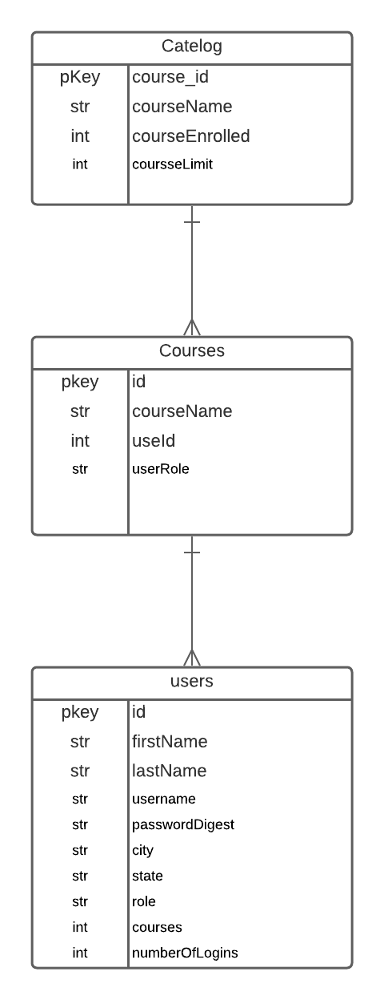

# Admin Panel
Date: May 12, 2021 By: Luis Rojas-Huerta 
***
# Description
The application is intented to demonstrate an admin panel that is able to create/delte/modify/get all users. Currently the assign courses and group assignment is not functional.
***
Technologies Used

***
# Getting Started
To initialize the application npm start in the client file and npm run dev on the main directory to start up the server. The user will be directed to the sign in page where the Admin login is:  
username: gchalmers  
password: password123  
Currrently refreshing the page will send the user to the sign in page, in order to navigate back use the back arrow.
***
# ERD
